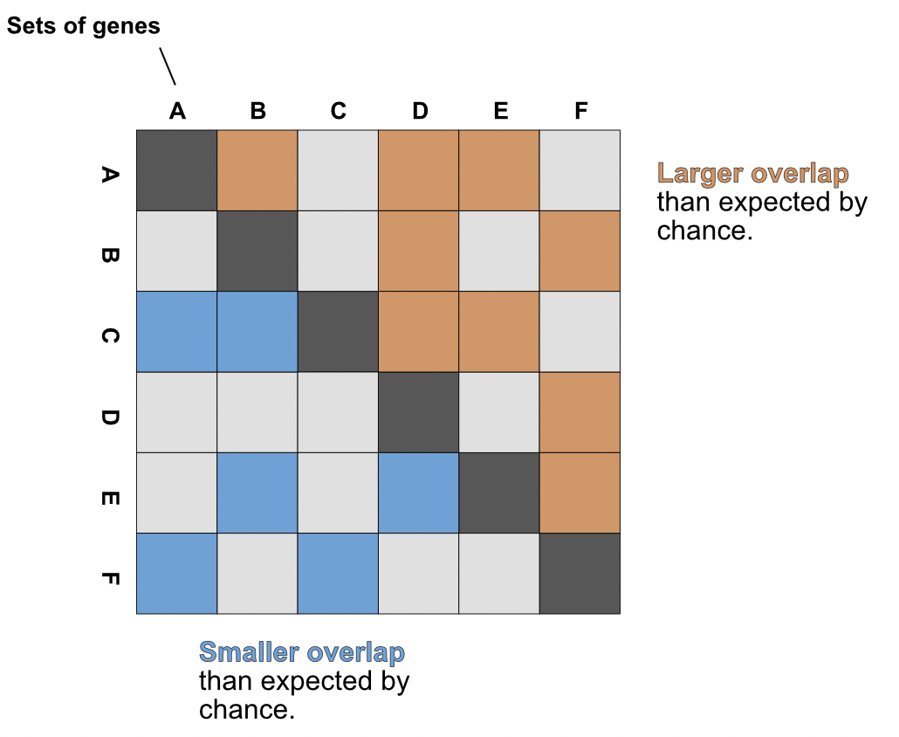

## genesectR

*A tool for producing virtualplant.org style genesect analyses in R*

### What is a genesect plot?
Genesect analyses are a useful technique for comparing the overlap of sets of genes. These analyses can perform pairwise comparisons between sets, giving the direction, magnitude, and statistical significance of these overlaps. This package uses one-tailed Fisher Exact Tests to calculate the odds-ratio and p-value for set overlaps and plots in a quadrants to indicate enrichment or depletion. 

Magnitude is shown through the log2 transformed Fisher odds-ratio. Significance is shown as the log10 transformed pvalue. Gene overlap between sets is shown in parentheses. 

Similar analyses are available in the web-based utilities [virtualplant.org](virtualplant.org) and [connectf.org](connectf.org).  

### Installation

This tools is simply installed using the devtools libraries in R.

    if(!require(devtools)) install.packages("devtools")
    library(devtools)

    install_github("NateyJay/genesectR")

### Example

Here is a simple example of the syntax for a basic run:

    require(stringr)

    # formatting fake input data
    master_set <- str_glue("Gene_{1:1000}")

    ls <- list(Set_A= sample(master_set, 300),
             Set_B= sample(master_set, 27),
             Set_C= sample(master_set, 99))
 
    # performing analysis and plotting
    gs <- gs_import(ls, master_set)
    gs <- gs_compute_matricies(gs)
    gs_plot_fischer(gs, breaks=3) # breaks is a vector which inserts spaces before the indexed boxes
    

